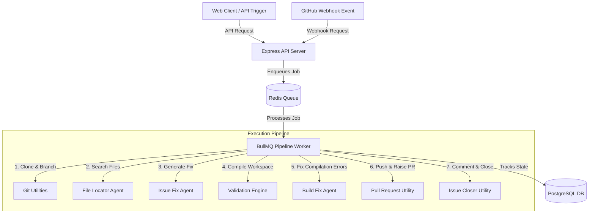

# System Architecture

This page outlines the technical architecture of **Avenor**, showing how the different layers interact to automate repository maintenance.

---

## High-Level Architecture

Avenor consists of three primary layers:
1. **API / Routing Layer**: Serves express endpoints to trigger and manage analysis jobs, process webhooks, and authenticate users.
2. **Orchestration & Queue Layer**: Enqueues and schedules background jobs using **BullMQ** (powered by **Redis**) and tracks state inside a **PostgreSQL** database via **Prisma**.
3. **Execution & AI Layer**: Clones repositories, spawns interactive AI tool loops to explore the codebase, generates unified patches, compiles projects locally, and pushes code changes back to GitHub.

---

## Architectural Modules

### 1. Database Schema (`prisma/schema.prisma`)
The system maps relationships between repositories, jobs, logs, and pull requests:
* **User**: Manages credentials, avatar URLs, and references to cloned repositories/PRs.
* **Repository**: Records GitHub repos linked to Avenor (storing name, description, and privacy flags).
* **Job**: Tracks background execution status (`RUNNING`, `WAITING_FOR_USER`, `COMPLETED`, `FAILED`), completed timestamps, and holds a foreign key reference to the created `PullRequest`.
* **Log**: Collects real-time worker pipeline logs for debugging.

### 2. BullMQ Worker (`src/queue/pipeline.worker.ts`)
The orchestrator that runs the background job loop. It:
1. Listens for new or resumed tasks in the `pipelineQueue`.
2. Updates Prisma job states in real-time.
3. Invokes the core analysis service (`analyzeRepository`).
4. Handles `WAITING_FOR_USER` pausing when an agent needs feedback, allowing the worker to finish execution gracefully without blocking the thread.

### 3. Service Layer (`src/services/`)
* **Pipeline Service (`pipeline.service.ts`)**: The orchestrator function that binds the steps together, calling the git utils, agents, validation, and PR utils sequentially.
* **GitHub Service (`github.service.ts`)**: Integrates Octokit authenticated client sessions via GitHub App private key files. Provides calls to fetch repo details, file trees, issues, and submit PRs/comments.

### 4. Agent Layer (`src/agents/` & `src/tools/`)
* **Agent Runner (`agentRunner.ts`)**: An autonomous step execution loop that interacts with OpenRouter. It dynamically parses tool calls, executes them locally in the cloned repository path, feeds back results, and handles token pruning for context conservation.
* **Agent Tools (`agentTools.ts`)**: Local tool execution functions that the AI can call, including directory listing, file reading, code searching, symbol reference finding, asking questions, and submitting patches.
